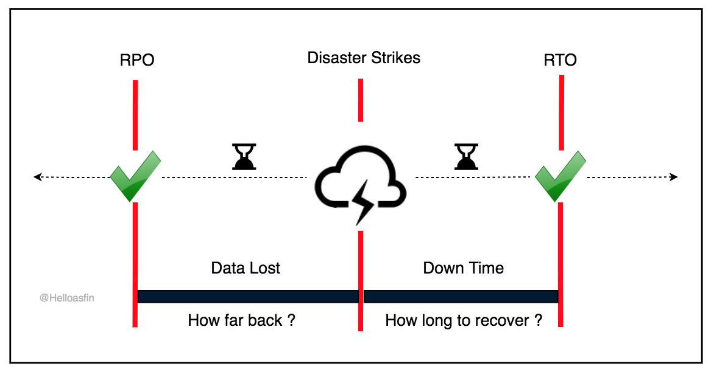

# Backups

Backups in short facts.
Backups should not be on the same physical storage with your Production system.

# Example setup for databases

| Backup settings           |                |
| ------------------------- | -------------- |
| Scope                     | LIVE           |
| Full                      | Sunday         |
| Incremental               | Immediately    |
| Differential              | -              |
| Strategy                  | 2-1-1          |
| Rotation*                 | 90d, 30d       |
| Compression               | No             |
| Encryption                | Yes            |
| Testing                   | Yearly         |
| Monitoring                | Yes            |

* We'll keep 30days backups (full+incremental), so it's possible to restore at any point within 30days
* We'll keep one full backup from each month and from last 3 months.

# Possible options

## Business requirements 
* RTO: Recovery Time Objective is the amount of downtime a business can tolerate.
* RPO: Recovery Point Objective the amount of data that can be lost within a period.

Image is from: https://medium.com/@asfinachdian/rpo-vs-rto-difference-71b09dc96f78

## Types
* Full (If size and backup time is acceptable, then go for daily Full backups)
* Differential
* Incremental

## Strategy 
* Backup 3-2-1 (3 copies of data, 2 different media, 1 being off site)
* Custom (2-2-1, 2-2-0, ...)

## Rotation
* Grandfather-father-son
* Custom (3 months, 3 0days)

## Data at rest
* Encryption

## Regular testing (Often overlooked or with low priority)
* Yearly
* Quarterly 

## Monitoring (Ofter not implemented)
* Status (OK or failed)
* Backup time 

