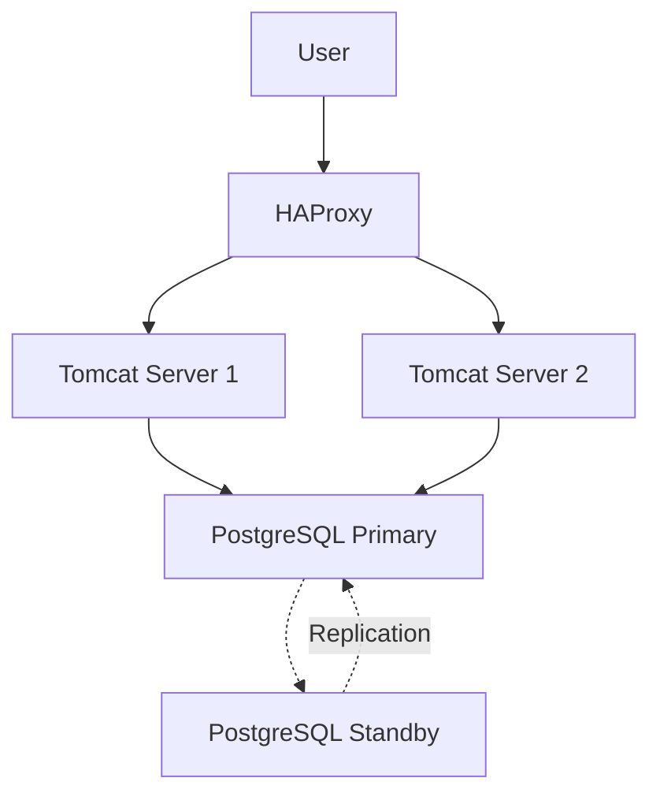
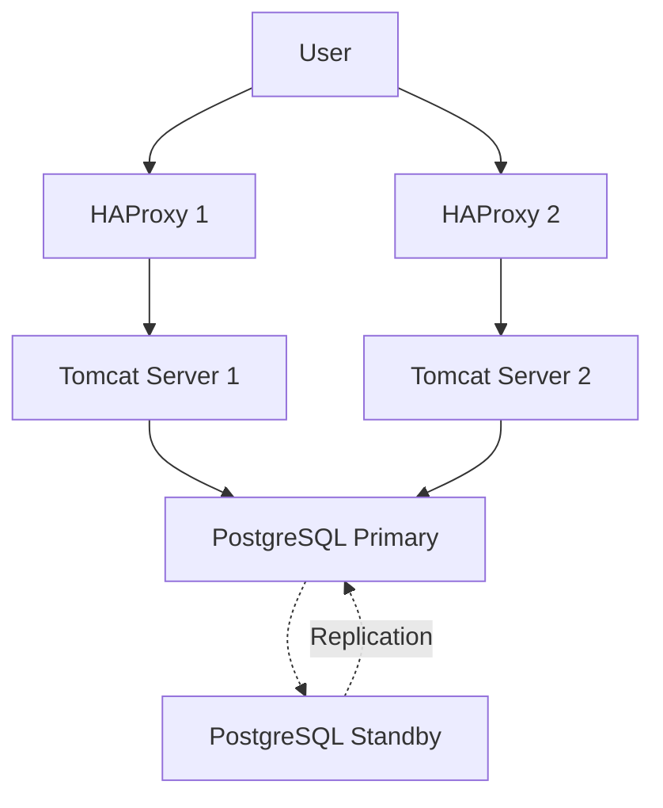
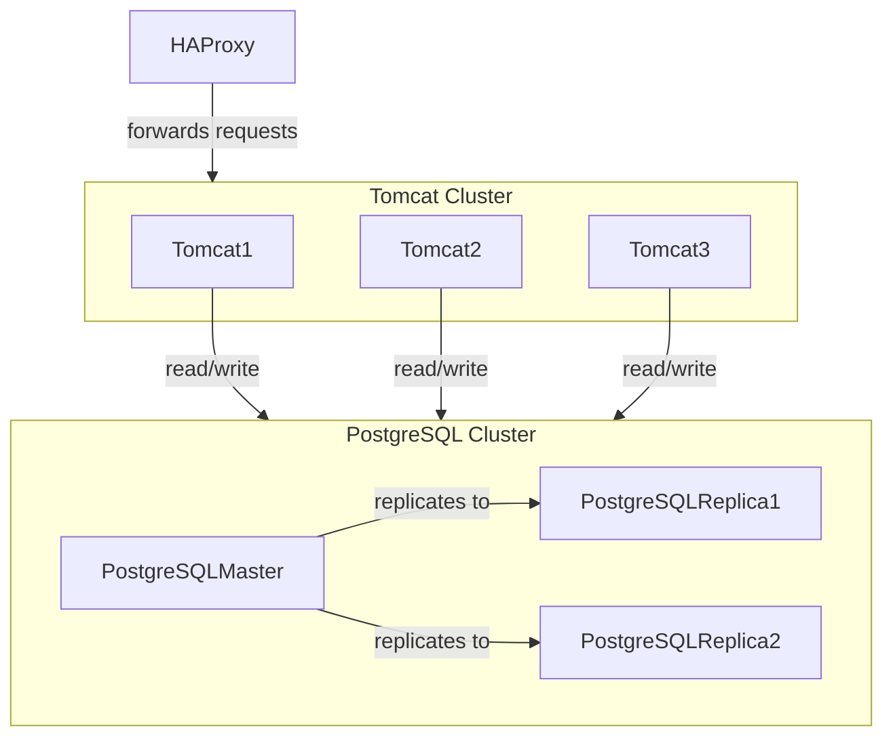

# Diagrams

## Some examples with Mermaid

### 1 HAproxy + 2 Tomcat + Active/standby PostgreSQL

### 1 HAproxy + 2 Tomcat + Active/standby PostgreSQL

### 1 HAproxy + Tomcat Cluster + Active/standby PostgreSQL

