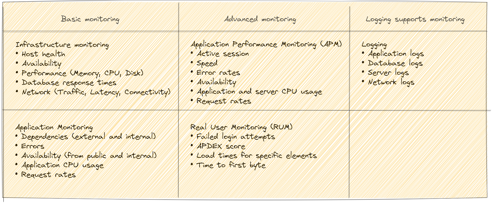

# Monitoring

One can say that monitoring can be divided two parts:

* Basic monitoring aka Infra part. Usually tools like Zabbix, Prometheus, Grafana, Statuscake etc.  
It's quite common that basic monitoring is enabled and maintained by Infra/Ops team.

* Advanced monitoring aka Application monitoring. Tools like Prometheus, Grafana, AppDynamics, Dynatrace etc.  
Is enablement comes from the developers and business side.

Good setup has a centralized logging enabled like ELK, OpenSearch etc. Logging can compliment our monitoring set.

