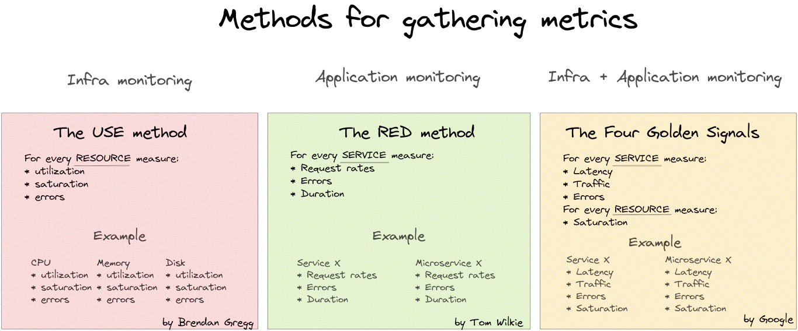
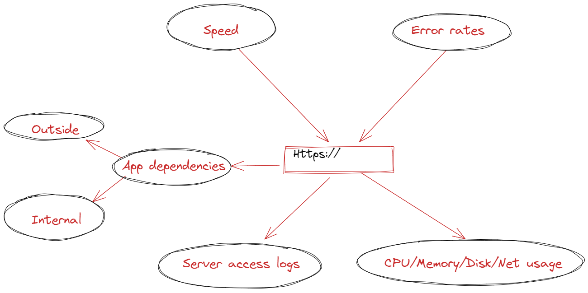

# Monitoring

Monitoring can be divided two parts:

* Infra monitoring  
Usually tools like Zabbix, Prometheus, Grafana, Statuscake etc.  
It's quite common that basic monitoring is enabled and maintained by Infra/Ops team.

* Application monitoring  
Tools like Prometheus, Grafana, AppDynamics, Dynatrace etc.  
Is enablement comes from the developers and business side.

Good setup has a centralized logging enabled like ELK, OpenSearch etc. Logging can compliment our monitoring set.

# Methods for gathering metrics

In short summary:

* USE is all about RESOURCE metrics. 
https://www.brendangregg.com/usemethod.html 

* RED is about gathering SERVICE metrics. 
https://www.weave.works/blog/the-red-method-key-metrics-for-microservices-architecture/ 

* The Four Golden Signals gather metrics each SERVICE + RESOURCE Saturation. 
https://sre.google/sre-book/monitoring-distributed-systems/ 

# Application performance monitoring (APM)

# Zabbix Best practice

## One Zabbix for production and test servers  - use dedicated templates

When use one Zabbix to monitor both production and test servers.
It is a good idea to separate templates customized for the unique needs and characteristics of each environment.
This strategy helps to ensure accurate monitoring, minimizing false positives and preventing overlooked issues.

Production environments typically require more strict monitoring with a focus on high availability and performance.
Test environments generally have different monitoring requirements. While it's important to monitor these environments, the focus is more on ensuring that tests run smoothly without necessarily alerting on every small issue.

Example case with Linux monitoring:

Create dedicated templates.
For example, case Linux by Zabbix agent

**Production Templates**
* Change the template name to **Prod_Linux_server**
* Keep the template with default settings, as the Zabbix default template is quite good.

**Test Environment Templates**
* Change the template name to **Test_Linux_server**
* Changes compared to original template:
  - CPU Load > 90%
  - Memory Usage > 95%
  - Disk Space < 5% Free
  - Disable Swap usage
