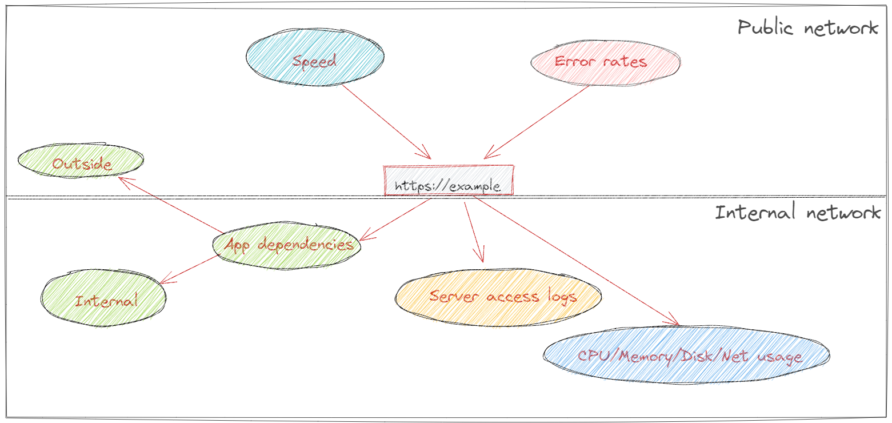

# Monitoring

General monitoring for application 

## Linux (Minimal)

- CPU usage (Load)
- Memory usage
- Disk usage
- I/O wait
- I/O (Filesystem like ext4, xfs) Error monitoring/altering is a must! 
- Time

