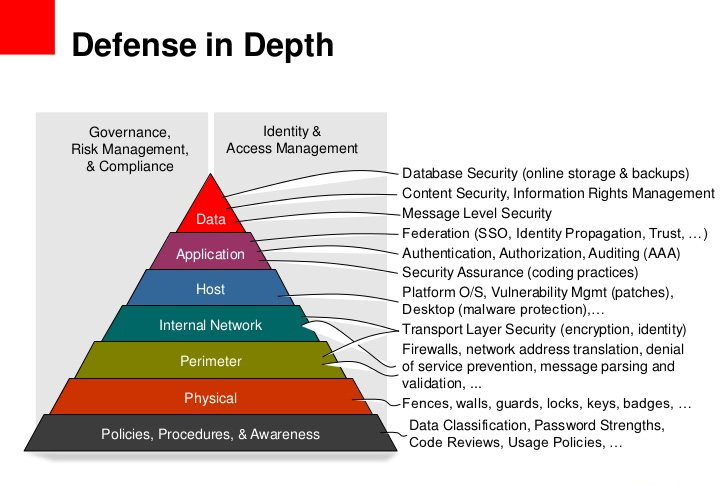
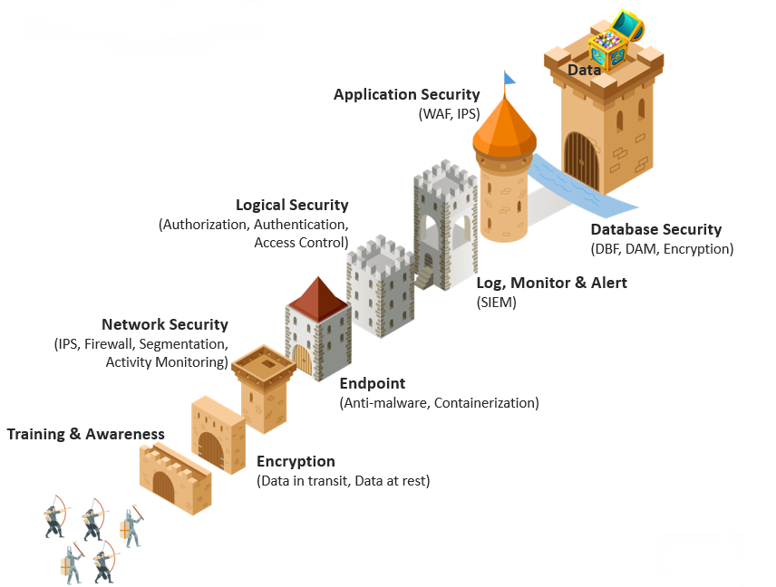

# Security section for Infra 

Security topic is quite wide, I just going to cover some important section.
I not going to cover network part, has it is huge

# Authorizaion 
- complex 
- ssh keys
- MFA

# 

- least privilege approach

# Bastion

# Audit 

# Secret management 

Consider tools like
- Hasicorp Vault

# Certificates

# Logging 

- Local 
- Elasticsearch (ELK)
- Graylog
- OpenSearch 

# Firewall 

# VPN

- OpenVPN
- 

# Data

## Data at rest

Tools like

[Deep dive into data at rest](data-at-rest.md)

## Data in motion 

## Defends in layers

