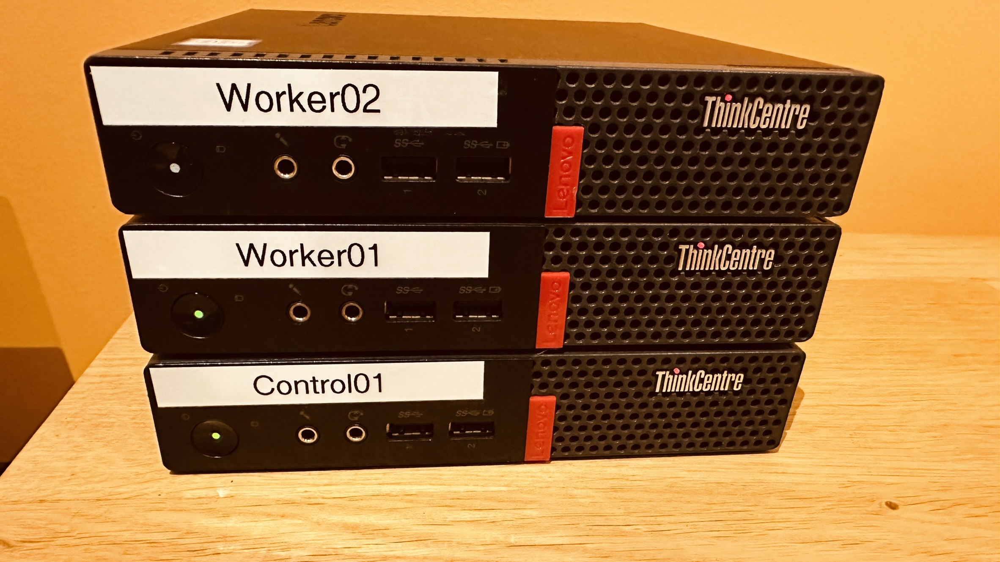

# Building a Small Bare Metal Kubernetes Cluster with Kubespray



## Hardware

- **ThinkCentre M910q (3)**
  - **CPU:** i5-6500T 2.50GHz
  - **Disk:** 256GB SSD
  - **Memory:** 8GB (control) / 12GB (worker)
  - **Ethernet:** Gigabit

## Preparations

1. Download the Rocky Linux 9 minimal ISO from [Rocky Linux](https://rockylinux.org/download/).
2. Use BalenaEtcher to create a bootable USB.
3. During Linux installation, set static IP.

## Linux Installation

1. Copy the public key to nodes:

    ```bash
    ssh-copy-id user@192.168.10.70
    ssh-copy-id user@192.168.10.71
    ssh-copy-id user@192.168.10.72
    ```

2. After installation, disable the firewall:

    ```bash
    systemctl stop firewalld && systemctl disable firewalld
    ```

## Kubespray Setup

1. Clone Kubespray and install requirements:

    ```bash
    git clone https://github.com/kubernetes-sigs/kubespray.git
    pip3 install -r requirements.txt
    ```

2. Copy the sample inventory and configure hosts:

    ```bash
    cp -rfp inventory/sample inventory/mycluster
    declare -a IPS=(192.168.10.70 192.168.10.71 192.168.10.72)
    CONFIG_FILE=inventory/mycluster/hosts.yaml python3 contrib/inventory_builder/inventory.py ${IPS[@]}
    ```

3. Modify `inventory/mycluster/hosts.yaml` with node details.

    ```yaml
    all:
    hosts:
        control01:
        ansible_host: 192.168.10.70
        ip: 192.168.10.70
        access_ip: 192.168.10.70
        worker01:
        ansible_host: 192.168.10.71
        ip: 192.168.10.71
        access_ip: 192.168.10.71
        worker02:
        ansible_host: 192.168.10.72
        ip: 192.168.10.72
        access_ip: 192.168.10.72
    children:
        kube_control_plane:
        hosts:
            control01:
        kube_node:
        hosts:
            control01:
            worker01:
            worker02:
        etcd:
        hosts:
            control01:
        k8s_cluster:
        children:
            kube_control_plane:
            kube_node:
            etcd:
        calico_rr:
        hosts: {}
    ```

4. Change K8s-cluster values:

    ```bash
    vi inventory/mycluster/group_vars/k8s_cluster/k8s-cluster.yml
    ```

   Ensure the following values:

    ```yaml
    kubeconfig_localhost: false
    kube_proxy_mode: iptables
    kube_network_plugin: flannel
    ```

5. Deploy Kubernetes:

    ```bash
    ansible-playbook -i inventory/mycluster/hosts.yaml --become --become-user=root cluster.yml
    ```

## Verification

1. Log into the control node:

    ```bash
    kubectl get nodes -o wide
    ```

    ```
    NAME        STATUS   ROLES           AGE   VERSION   INTERNAL-IP     EXTERNAL-IP   OS-IMAGE                      KERNEL-VERSION                CONTAINER-RUNTIME
    control01   Ready    control-plane   14m   v1.28.4   192.168.10.70   <none>        Rocky Linux 9.3 (Blue Onyx)   5.14.0-362.8.1.el9_3.x86_64   containerd://1.7.8
    worker01    Ready    <none>          13m   v1.28.4   192.168.10.71   <none>        Rocky Linux 9.3 (Blue Onyx)   5.14.0-362.8.1.el9_3.x86_64   containerd://1.7.8
    worker02    Ready    <none>          14m   v1.28.4   192.168.10.72   <none>        Rocky Linux 9.3 (Blue Onyx)   5.14.0-362.8.1.el9_3.x86_64   containerd://1.7.8
    ```

2. Verify the cluster:

    ```bash
    kubectl get nodes
    kubectl cluster-info
    kubectl apply -f https://k8s.io/examples/application/deployment.yaml
    ```

---

**Note:** The output from the playbook execution indicates the success of the deployment, and the subsequent `kubectl get nodes` command shows the status of the nodes in the Kubernetes cluster.